# This is Tutorial for GitHub Starter

- step1: prepare required program (기본 프로그램 설치)
- step2: GitHub repository system build (깃허브 인터넷 저장소 만들기)
- step3: GitHub use routine (설치된 깃허브 사용방법)

 

## STEP 1. prepare required program (기본 프로그램 설치)

>## Required program : [Git](https://git-scm.com/) 

### ( After Git setup, we will use [ Git Bash ] in the Git folder )
### ( Git 설치가 끝나면 그 안에 설치된 Git Bash를 써야 합니다 ) 

 

## STEP 2. GitHub repository system build (깃허브 인터넷 저장소 만들기)

 

### 1. go to Your own repository in GitHub ( GitHub에서 자신의 repository로 들어갑니다 )

### 2. click "new" button to create new repository (new 버튼을 클릭해서 새로운 저장소를 생성합니다.)

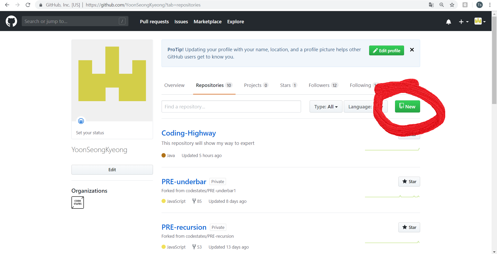

 
 

### 3. check **Initialize this Repository with README** for shortcut **without init and repository setting in terminal**
### ( **Initialize this Repository with README** 체크박스를 체크합니다. README파일을 만들어서 **init-repository setting 과정 없이** clone 만으로 간단하게 setup합니다. )

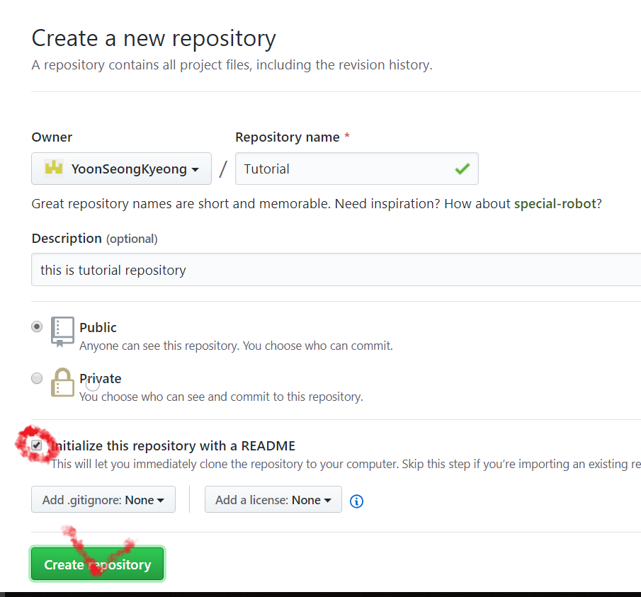

 
 

### 4. click clone button and copy URL of this page 
### ( 이제 새로 만들어진 저장소의 URL을 복사해서 clone을 준비합니다 )

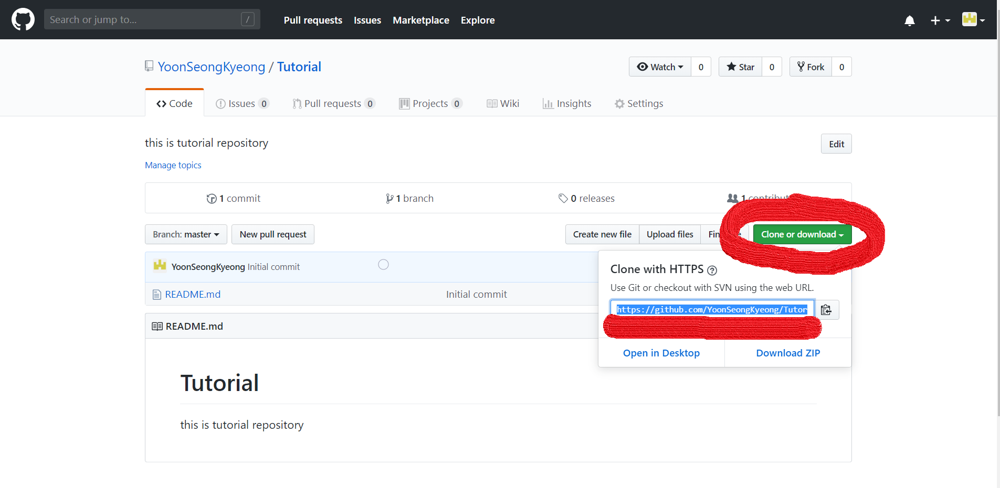

 
 

### 5. make a folder to contain clone 
### ( 바탕화면에 clone된 파일을 담을 폴더를 생성합니다. )

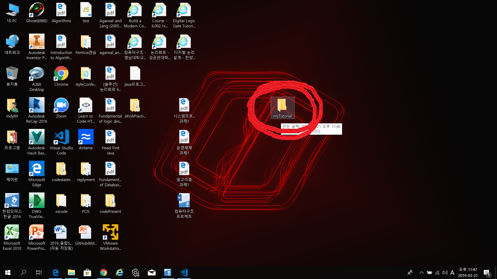

 
 

### 6. at new folder, click mouse right button and select **Git Bash Here** 
###  ( 새로운 폴더에서 마우스 오른쪽 버튼을 눌러서 **Git Bash Here**를 선택한다. )

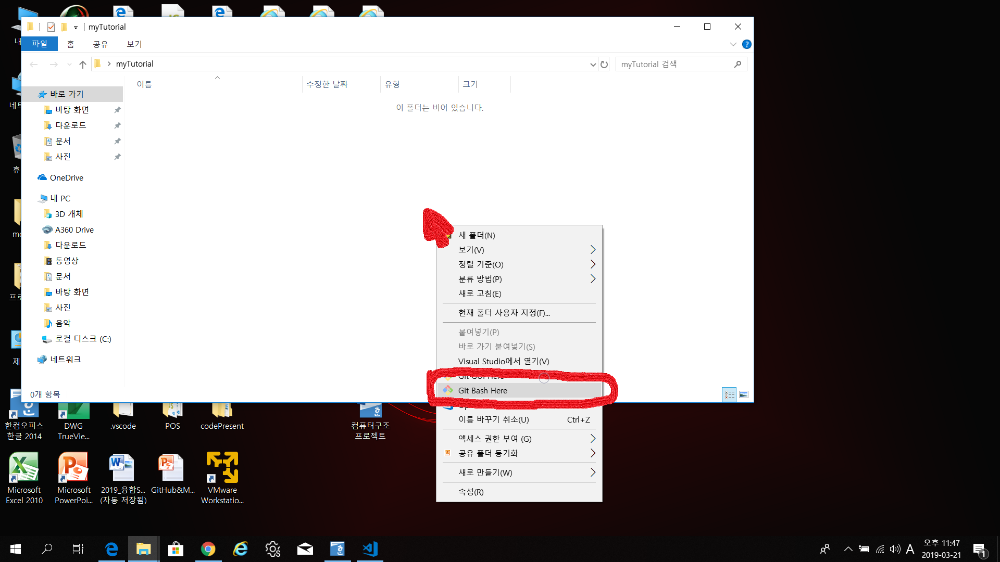

 
 

### 7. Git Bash is opened at current directory[file position]
### (현재 directory[파일위치]로 Git Bash가 열립니다.)

### 8. if you are first at Git Bash, you have to register Your UserName and UserEmail
###  (Git Bash가 처음이라면 UserName과 UserEmail을 설정해줘야 합니다.)
## **Use this format**

> $ git config --global user.name "John Doe"

> $ git config --global user.email johndoe@example.com

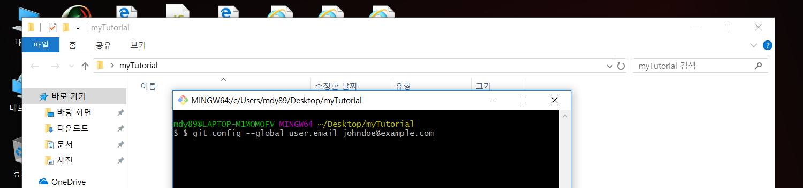

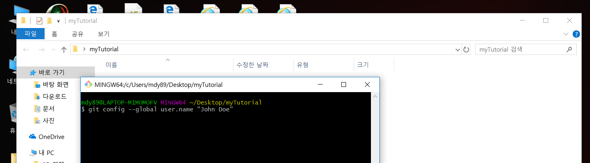

 
 

### 9. Now let's clone!!! ( Clone을 다음 명령어로 진행합니다. ) 
## **Use this format**

> git clone URL_You_Copied 

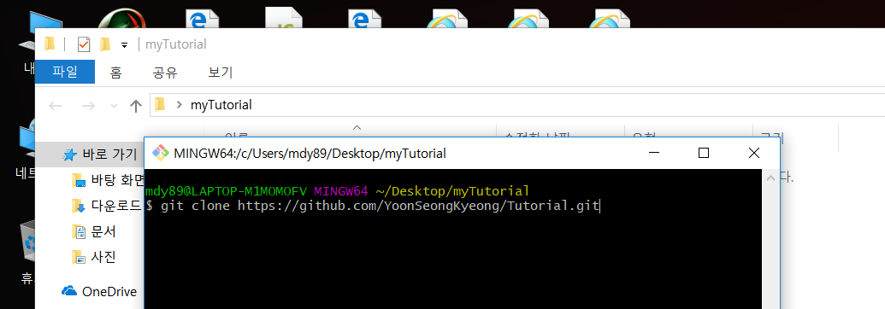

 
 

### 10. Clone Finished and You can find README of repository is created 
### ( 클론이 끝났고 인터넷 저장소에 있는 README가 생긴걸 볼 수 있습니다. )

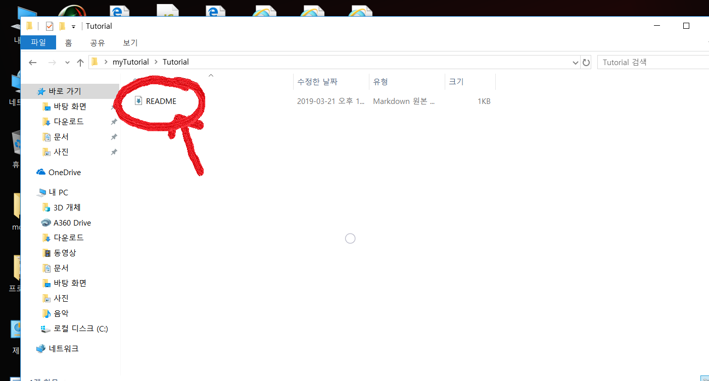

 
 

### 11. You can also find new cloned folder appear by <ls command>
### ( clone된 폴더가 생긴것을 ls (list) 라는 커맨드로 확인할 수 있습니다.)
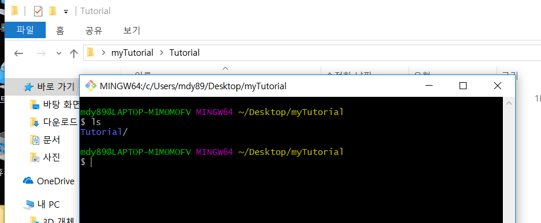

 
 

### 12. By <cd command> you can go into master directory, which is linked to internet repository. 
### ( cd command(change directory)를 통해서 master directory로 이동할 수 있습니다. master directory는 internet repository와 연결되어 있습니다.)

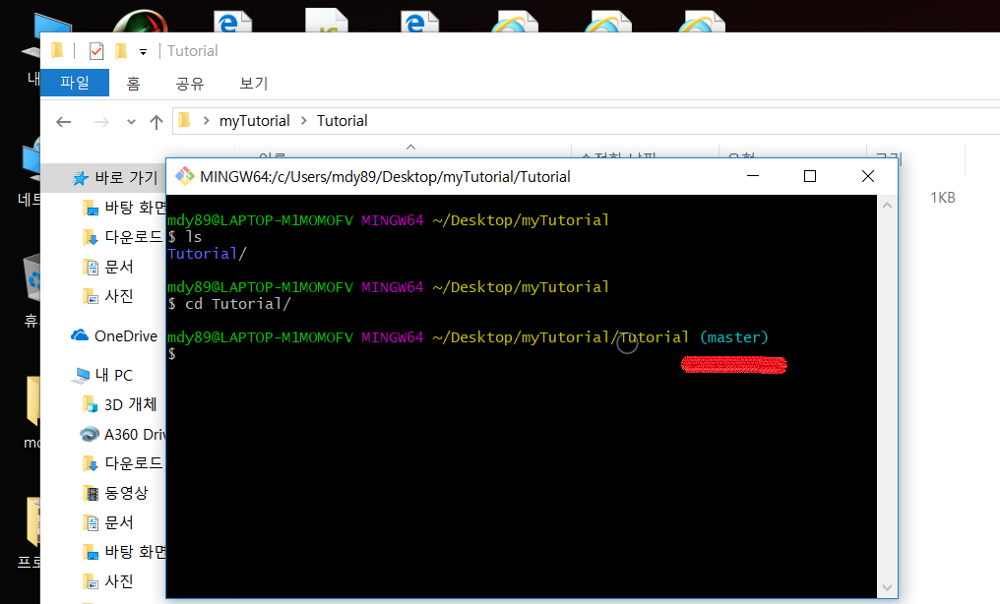

 

 

 

## step3: GitHub use routine (설치된 깃허브 사용방법)

### 1. OPEN README file in code editor ( 파일 에디터로 README파일을 엽니다. ) 

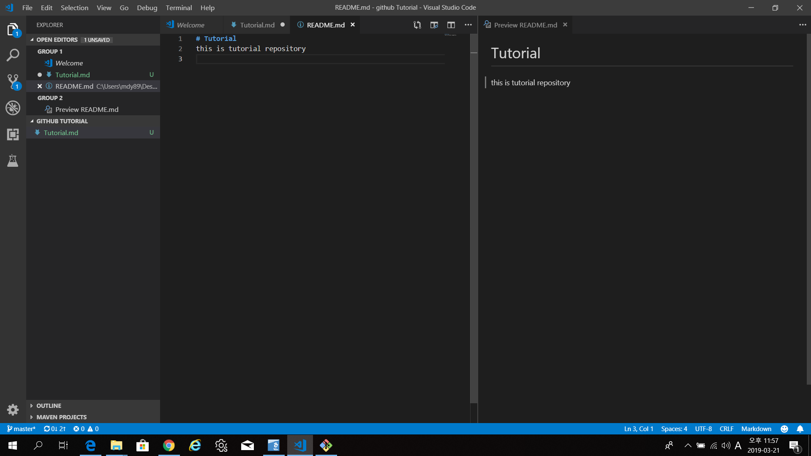

 
 

### 2. ADD "HELLO WORLD" to README file and save ( README파일에 HELLO WORLD라는 내용을 추가하고 저장합니다. )

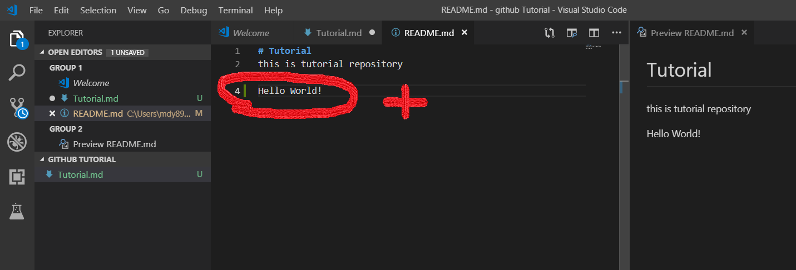

 
 

### 3. open Git Bash in master directory and use **git status** to know check an **issue**
### ( clone된 master directory에서 **현재 상태**를 알기 위해서 **git status** 를 command로 입력합니다. )
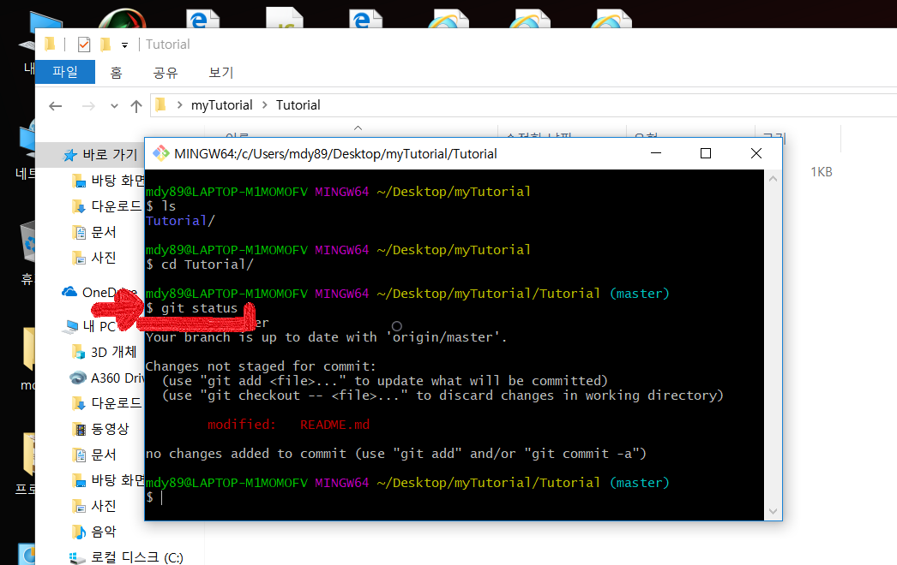

 
 

### 4. [optional]for **detail on what is changed**, use **git diff**
### ([필수 아님]구제척으로 **어떤게 바뀐 건지** 확인하기 위해서 **git diff**를 command로 입력합니다. )

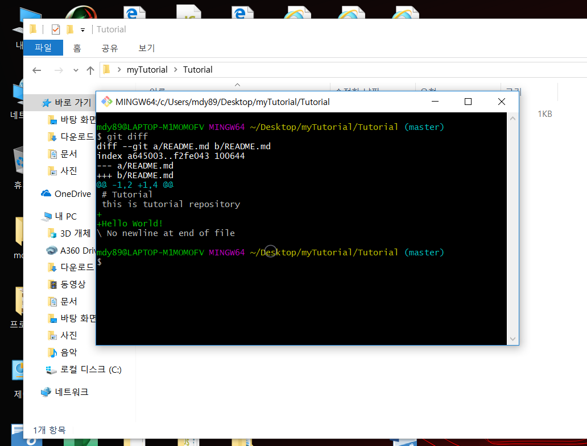

 
 

### 5. to **confirm and update repository in Local Area(=stage)** , use **git add File_Name** command
### ( 현재 바뀐 점을 **승인**하고 **컴퓨터의 offline repository에 update**하기 위해서 **git add File_Name** command를 사용합니다. )

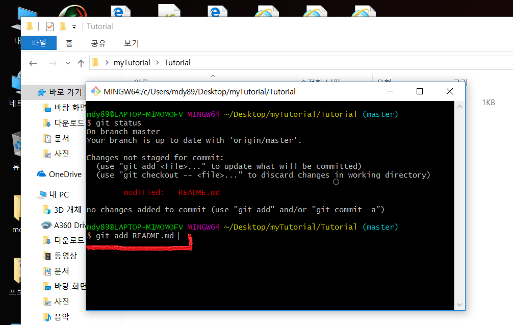

 
 

### 6. for final confirm of added things and making comment for this change, use **git commit -m "STRING_FOR_COMMENT"** command
### ( add된 변경의 최종 승인과 함께 현재 변경을 설명하는 코멘트를 남기기 위해서 **git commit -m "STRING_FOR_COMMENT"** command를 사용합니다. )

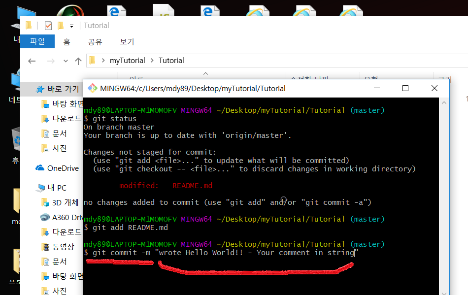

 
 

### 7. you can submit **this changed local state** to **internet repository** by using **git push origin master** command
### ( 현재 바뀐 **컴퓨터 내부 저장소의 상태**를 **인터넷 저장소**까지 업데이트하기 위해서 **git push origin master** command를 사용합니다. )

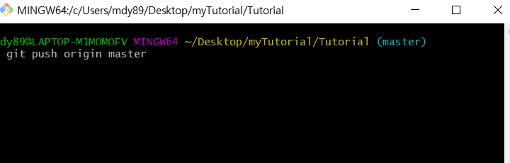

 
 

### 8. you can see the update is complete in github, Hello World is on Internet!
### ( 인터넷 저장소 업데이트가 성공한 것을 github에서 볼 수 있습니다! )

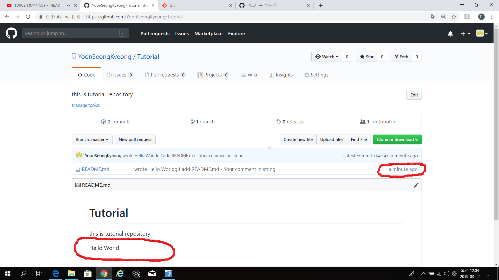

## If you are success in Step 2, What you need to manage program is only [ **git status / git add / git commit -m / git push origin master** ] forever
## ( 한번 STEP2까지 마치면 [ **git status / git add / git commit -m / git push origin master** ]정도만 사용해서 프로그램을 관리하면 됩니다. )

 
 

>## Good site for U: [Git Easy english](https://rogerdudler.github.io/git-guide/index.html) http://gitimmersion.com
>## 도움되는 사이트: [Git Easy 한글](https://rogerdudler.github.io/git-guide/index.ko.html) 

## I wanna study deeper = [Git total tutorial](http://gitimmersion.com)