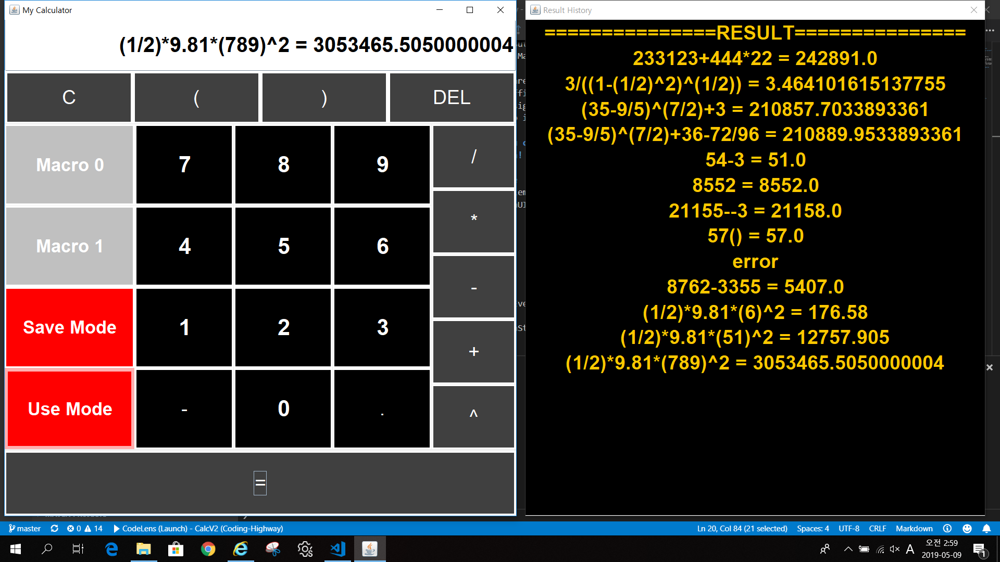

# Calculator SPEC

## you can use operation with  **+  -  *  /  (  )**
## you can see **all the history things** at the **right dialogue**
## you can **even use macro service** that **save** and **load** the equations
## you can use **negate** operation to make number **negative**
## you can even just **type** or **copy** and **paste** to **textarea** and just **push = button** to calculate
## this calculator **checks validation of nested level** of **parenthesis ( )**
## the fact that you can use macro means that : this calculator **have potential to quckly serve more diverse function** like **^ (Power)** or **root** ...
## **feel free to enjoy the calculation!**

># Java polymorphism
>## There are many aspects in this program that use OOP and polymorphism
>## First is OOP : inherit from JButton, CalcButton has many children { OperandButton, OperatorButton, MacroButton, MacroModeSwitch } and Rules the general style of Buttons & Serves a ID information
>## next, OperandButton has two children { NumButton, SpecialOperand } also OperatorButton has a child { ParenthesisButton }
>## all specific types like { MacroModeSwitch, MacroButton, NumButton, ParenthesisButton, SpecialOperand } has own specific description.
>## Second is Polymorphism, Even though there are so many classes, Structuring by Common protocol is done with **idAddingButtonCollector**, you can see how efficient it is to use one common actionListener to Handle ordinary buttons.
>## **Using Get/Set method, Object Oriented Design gave me Micro Control for each Components like font-size, while Handling Most common Features with only a short code. So it is Far more easy to revise and add more Spec!**

# you can now use ^ (exponent operation) -> You can calculate t/((1-(v/c)^2)^(1/2))  :  equation for time expansion
# Also you can determine the standard deviation!

# inner class can be made for modular structure 
    class DelButton extends OperatorButton implements ActionListener {
        private static final long serialVersionUID = -6856053687074544675L;

        DelButton(String text) {
            super(text);
            this.addActionListener(this);
        }
        /* ActionListener For delButton */ 
            @Override
            public void actionPerformed(ActionEvent e) {
                deleteTerm();
                textInterface.setText(operationString);
            }
        /* ActionListener For delButton */
    }
## But this modular structure is far more longer and complex to read than usual code
    /* ActionListener For delButton */
    delButton.addActionListener(new ActionListener(){
    
        @Override
        public void actionPerformed(ActionEvent e) {
            deleteTerm();
            textInterface.setText(operationString);
        }
    });
    /* ActionListener For delButton */
## If the modularity is necessary (longer code for component) then modulize will be considered for readability

