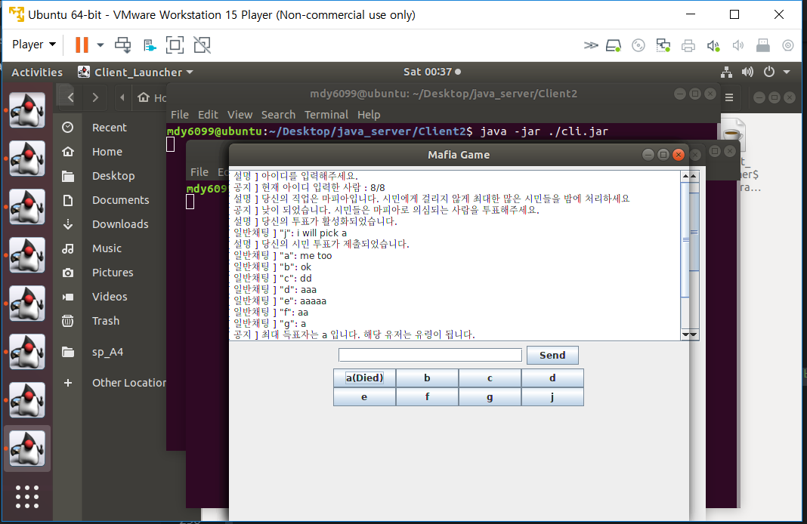
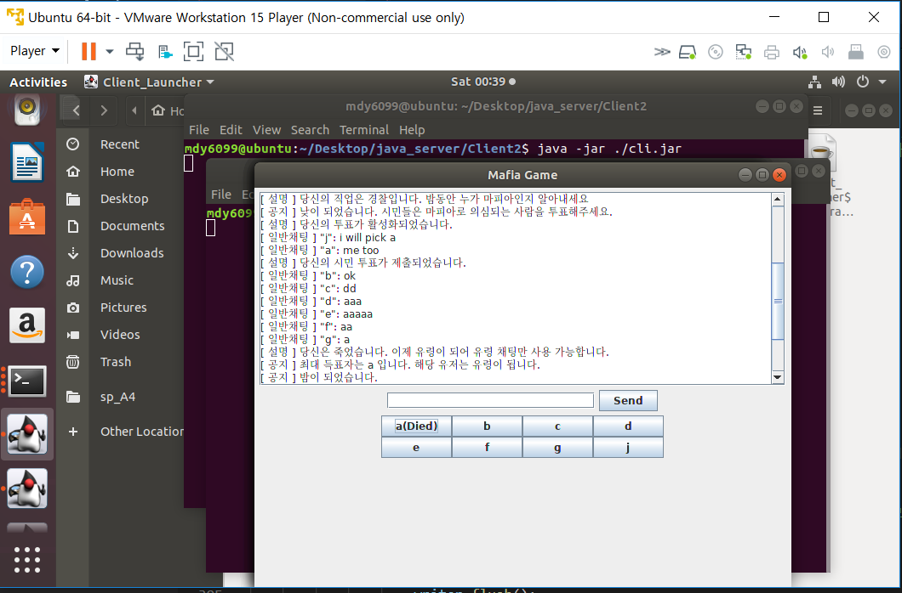
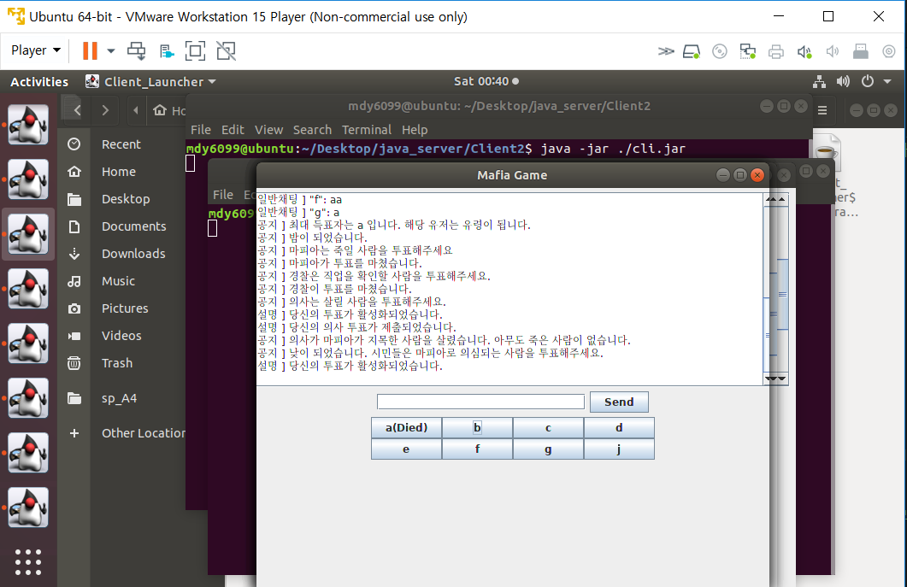
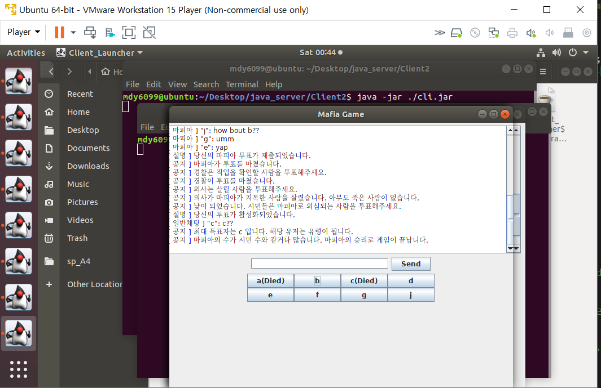

# 이 프로그램은 채팅을 이용한 마피아 게임입니다. (2019/06/07 에 시작)
## 이 프로그램의 코드는 [head first java](https://www.amazon.com/Head-First-Java-Kathy-Sierra/dp/0596009208) 의 일부 코드를 사용했습니다.  

## 개선할 수 있는 issue들 
- 채팅을 한글로 칠 수 있게 만들기
- 접속자가 8명이 넘었을 때 새로운 방을 만들거나 하는 handling
- 중간에 누군가 나갔을 때의 handling 

## 참고 : 현재는 test용으로 client의 socket 연결이 localhost로 잡혀있어서 실제 서버에 돌릴 때는 해당 서버의 ip를 넣어야 한다. (make connection method의 try 첫번째 줄)

### [실행 모습]

## 1번 목표 : 채팅 구현하기 - 각 플레이어의 id와 함께 구현 (2019/06/07에 완료 + GUI 미완성)

# **[서버 소켓은 9999번을 사용해서 연결한다.]**

### **클라이언트**
- **main thread** : GUI initialize + writing 구현
- **reader thread** : 서버에서 받아온 line을 채팅창에 print해준다.

#### 클라이언트 - object 설명
- **Client_Launcher** : 클라이언트 역할의 전체를 수행하는 런쳐. 나머지 클래스를 innerclass로 가지며 main method에서 해당 innerclass들을 instantiate 한다.
- **Chatting_Window** : 채팅창에 해당하는 오브젝트
- **Chatting_Scroller** : 채팅창의 스크롤 기능 구현
- **Chatting_Out** : 채팅방의 댓글창에 해당하는 오브젝트, 엔터키를 누르면 서버로 채팅을 전송한다.
- **SendButton** : 댓글창의 전송 버튼에 해당하는 오브젝트, 누르면 서버로 채팅을 전송한다.
- **Main_Frame** : GUI에서 프레임에 해당한다. Main_Panel을 담고 있다.
- **Main_Panel** : GUI에서 패널에 해당한다. 나머지 GUI요소를 모두 담고 있다.
- **IncomingReader** : Runnable 오브젝트로, 새로운 스레드에서 돌아가고, 서버에서 오는 input을 받아서 채팅창으로 전달하는 역할을 한다.

### **서버**
- **main thread** : 클라이언트에서 보내는 서버로의 연결 요청을 받아서 새로운 포트를 열어서 연결하고, 해당 연결을 관리하는 thread 실행
- **connection thread** : 클라이언트에서 채팅을 보낼때마다 모든 나머지 클라이언트에게 해당 내용을 보내준다.

#### 서버 - object 설명
- **Server_Launcher** : 클라이언트 역할의 전체를 수행하는 런쳐. 나머지 클래스를 innerclass로 가지며 main method에서 부른 go method로 최대 20개까지 client의 연결을 받아서, 전용 스레드로 연결을 생성하는 역할을 하고 있다. 클라이언트의 outputStream을 clientOutputStreams에 모아준다.
- **Client_Reciever** : Runnable 오브젝트로, 새로운 스레드에서 돌아가고, 클라이언트의 inputStream을 BufferedReader로 받아온 이후에, 클라이언트가 chatting을 보내면 tellEveryone method를 콜해서 모든 클라이언트에게 해당 message를 보내준다.

### ISSUE1 : 클라이언트가 만약 연결을 끊는다면 서버는 해당 클라이언트와의 연결에 대해서 어떻게 반응해야 하나?
[참고 사이트](http://clearpal7.blogspot.com/2016/06/vs.html) : http://clearpal7.blogspot.com/2016/06/vs.html
### 일단은 polling 방식으로 클라이언트와 주기적인 (생존확인?)을 해주면 되는데 **지금은 클라이언트가 들어온 이후에 게임이 끝날때까지 중간에 나가지 않는다고 가정하고 구현한다.** 

### ISSUE2 : 어떻게 ID에 따라서 채팅을 식별할까? + 어떻게 마피아게임의 투표(지목)정보(마피아의 지목, 의사의 지목, 경찰의 지목, 시민 투표)를 서버와 클라이언트에서 받을 수 있을까? + 어떻게 죽은 사람의 채팅은 표시되지 않게 만들 수 있을까? or 죽은 사람들끼리만 채팅하는 공간을 만들려면 어떻게 할까? + 죽은 뒤에 모든 사람들의 활동을 볼 수 있게 만들려면 어떻게 해야할까?

### split과 비슷한 method를 활용해서, 서버와 클라이언트가 연락을 주고받을 때 첫번째 '/'를 기준으로 앞에는 format정보를 alphabet으로 넣고, 뒤에는 contents를 넣어서 연락을 switch문으로 해석하면 된다.

## 2번 목표 : 마피아 게임 구현하기. (2019.06.08에 완료 GUI미완성) <시험기간이라서 방학까지는 더 업데이트 못함.>

### **클라이언트가 중간에 나가는 경우를 생각하지 않고, 인원수는 8명이 되어야 시작한다고 가정한다.** (해당 부분은 메인 로직 이후에 충분히 조정 가능한 부분이므로 생략한다.)

### 마피아게임의 로직은 전체 살아남은 사람이 마피아 인원의 2배 이하가 되기 전까지만 게임을 실행한다.

#### 게임 종료조건 
- **마피아 우승** : 마피아 인원이 살아남은 인원의 절반 이상 
- **시민 우승** : 마피아 전원 제거
  
#### 클라이언트는 한 채팅창에서 서버의 공지 or 일반 채팅 or 마피아 채팅 or 유령 채팅 등을 제공받는다. (모두 다른 색 + 포맷 정보를 같이 지원한다.) 
### ex: 
### [공지] "abc" 님이 지난 밤에 마피아에게 죽었습니다.
### [공지] 투표를 통해서 마피아를 지목해주세요.
### [채팅] "efg" : ㅠㅠ

### 클라이언트는 8개의 투표버튼을 가진다. 한 액션에 한번만 누를 수 있고 누르면 해당상황의 action flag에 따라서 서버로 해당 action의 format으로 투표가 전송된다. (ex 의사가 살릴 사람 지정)

### 플레이어들의 이름은 클라이언트와 서버가 처음에 통신할 때, client가 이름을 setting하는 message와 서버가 다른 사람의 이름을 client에게 알려주는 message가 해당 format으로 전송된다. 그 이후부터는 index나 알파벳index(알파벳을 정수로 parse하지 않고 바로  switch문에 사용하는게 효율적일수도 있다.)로 각 사람을 구분하게 된다.

#### 마피아 게임은 다음의 순서로 반복된다.

- 낮 : **시민의 투표** (투표가 다 이뤄지면 지목된 사람이 유령이된다. + 만약 최대 득표자가 복수면 무효로 처리되고 밤이 된다.)
- 시스템 : **마피아가 모두 죽었다면 시민의 승리로 게임이 끝난다.**
- 밤 : **마피아의 투표** (투표가 다 이뤄지면 지목된 사람을 저장하고 다음으로 넘어간다. 만약 최대 득표자가 복수면 무효로 처리된다)
- 밤 : **경찰의 투표** (투표가 다 이뤄지면 지목된 사람의 직업을 경찰에게 알려주고 다음으로 넘어간다.)
- 밤 : **의사의 투표** (투표가 다 이뤄지고 만약 **의사에게 지목된 사람이 마피아에게 지목된 사람이라면** 전체에게 **"[공지] 의사가 마피아에게 죽을뻔한 사람을 살렸습니다."** 라는 로그가 뜬다. **그렇지 않다면 [공지] ""아이디"님이 지난 밤에 마피아에게 죽었습니다."** 라는 로그가 뜬다. 이후 다시 **낮이 된다.**)
- 시스템 : **시민의 수가 마피아 수의 2배를 넘지 못하면 마피아의 승리로 게임이 끝난다.**

#### 마피아 게임의 채팅 시스템은 다음과 같이 동작한다. 

- **일반 채팅** : 낮동안 이뤄진다. flag가 낮일때만 채팅창에 해당 색깔로 표시된다.
- **마피아 채팅** : 밤동안 이뤄진다. flag가 마피아 채팅일때만 채팅창에 해당 색깔로 표시된다.
- **경찰 + 의사는 1명이라고 가정한다.** (만약 다수가 된다면 투표 시스템과 함께 채팅 시스템을 넣을 수 있다.)
- **유령 채팅** : 죽은 사람들끼리만 이야기할 수 있는 채팅이다. flag가 유령일때만 채팅창에 해당 색깔로 표시된다.

#### 마피아 게임의 투표 시스템은 다음과 같이 동작한다. 

- **서버** : 서버에서는 모든 **직업별로 클라이언트의 id (index와 아이디)를 관리**하며, 낮 + 밤의 각 phase마다 해당 클라이언트와 통신한다. **(flag를 setting하는 메세지와 함께 안내 메세지를 전달, 클라이언트에게서 투표/지목에 해당하는 message가 오면 그에 따라서 실행한다.)**

- **클라이언트** : 클라이언트에서는 **flag가 바뀐 다음 단 한번만** 버튼이 눌렸을 때 **해당 flag에 해당하는 format으로 눌린 버튼의 정보에 해당하는 투표/지목 message를 만들어서 서버로 보낸다.**

## + 생각해 놓은 추가 patch 방향 : 
- ### 새로운 직업 
    - 통신 기술자 : 낮동안 다른 사람의 아이디로 이야기할 수 있다.
    - 폭탄 기술자 : 지목한 사람의 집 앞에 폭탄을 설치한다. 해당 밤동안 누군가 그 앞을 지나가면 죽는다. (지목한 사람이 자기 자신이 아닌 누군가를 지목하거나 해당 사람을 누군가가 지목하면)
- ### 이벤트
    - 통신 오류 : 해당 낮동안 모든 사람의 채팅에서 아이디가 가려진다.