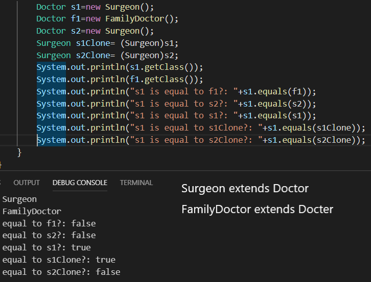

# This page is testing **OBJECT.getClass( obj ) & OBJECT.equals( obj )**

## this is Test implementation

### First, s1 s2 each represents the instance of Surgeon (subclass of Doctor)

### Second, f1 is representing instance of FamilyDoctor(subclass of Doctor)

### Third, s1Clone is another reference for s1, s2Clone for s2 (same Instance)

## I had doubt about this, when superclass **does not seem to have access inside the subclass** except **their(superclass's) own** Instance variables and methods, 

## What happens if **superclass reference is representing subclass** and we make the **Object method getclass( ) to tell us the class** of instace??  

## Q1. If Doctor class reference has Surgeon class instance which extends Doctor class, then **what will the getclass( ref ) return?**

## Q2. If **same class instance is on the equal( ) method**, will this **equal( ) returns true????**

## Q3. If **different class reference but representing same Instance goes into the equal( ) method** will this **equal( ) returns true????**

# **All the answer is in the console result** 
## Have Fun with finding **new interesting fact with object getclass( ) and equal( ) method yourself!!!**

## *below is the Conclusion. please try yourself to guess the Answer to the question*

## A1 : even if the reference type is Doctor, the getClass have the **Same type with Instance** ( *I guess object have some Instance variable describing the Class and when Instance pop out, constructor being called, constructor sets the variable as name of Class  -- just my guess* )

## A2 : the Object.equals( someObj ) can **identify the difference between Instances in Same Class!!!** (*maybe this is because of hashing to identify the instance -- just my guess*)

## A3: the Object.equals( someObj ) can **Even identify the equalness when another reference(can be different type) is referencing the same instance!! How smart!** (*maybe this is because of hashing to identify the instance -- just my guess*)
