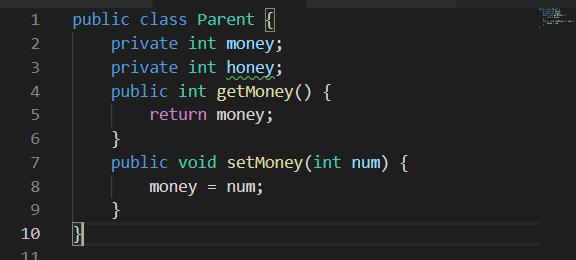
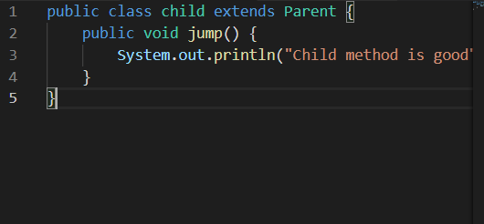
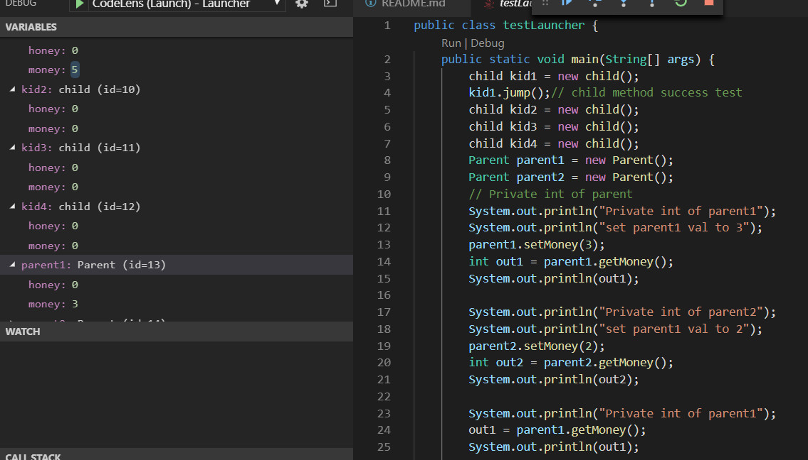
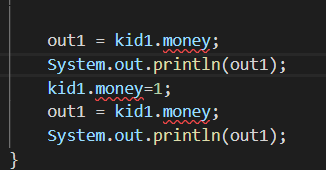

# This test is about how **superClass private Instance value** behaves in **subClass**

## I made 2 superclass instances [Parent] and 4 subclass instances [child]

## Superclass has **private int money**
## Superclass has handler named **void setMoney( int num )** and **int getMoney( )**

# What happens to parent's **private money value** and childrens **getMoney( ) return value** ?????

## 1. we can expect there is no money value in each child   **expected result: method fail because of no money value to set**

## 2. we can expect there could be some Common money value shared by children   **expected result : when we set child1 money value, money value of child2 is changed**

## 3. we can expect the object shape of superclass is all implemented in subclass instance and private value is not allowed for subclass element to handle   **expected result: when we call child.setMoney method, each child or parent's money value is independent and setting Money value does not affect to each other** 

# test

####    check Child method is good
####    set parent1 val to 3
####    check Private int of parent1 : 3
####    set parent1 val to 2
####    check Private int of parent2 : 2
####    check Private int of parent1 : 3
####    check Private int of child1
####    set child1 val to 5
####     check Private int of child1 : 5
####     set child2 val to 7
####     check Private int of child2 : 7
####     check Private int of child1 : 5
####     set child3 val to 9
####     check Private int of child3 : 9
####     check Private int of parent1 : 3
####     check Private int of child1 : 5
####     set child4 val to 6
####     check Private int of child4 : 6
####     check Private int of child3 : 9
####     check Private int of parent1 : 3

# Result

## expect 3 is right

## all children and parents had independent **money value in parent object**

## ~~so If we make parent's Instance value private, this value is not banned off from child's Instance, but hidden in deep inner of child Instance - in the child instance, there surely is private parent instance value which can be only accessed by parent's I/O method~~

##  ~~+ I wanted to see the hidden value from debugger, but It was hard to debug. stopping point didn't work~~

# I can see the evidence in debugger

## Parent has private int money, and I expected the subclass - child is unable to access money

 
 
 

## child extends Parent and usually unable to have money because it is superclass's private Instance value 
 
 
 

# But you can see **the Money and even Honey In child** !!!!
## and each money is **independent** each other!!!
 

# are Money and Honey accessible??

# No!! this code makes error because money is not accessible field
 

# Conclusion

## when you think of **private Instance value from superclass** in **subclass instance**, they are all **implemented into each instance as real** but is **never accessible** unless using **superclass's handling methods**